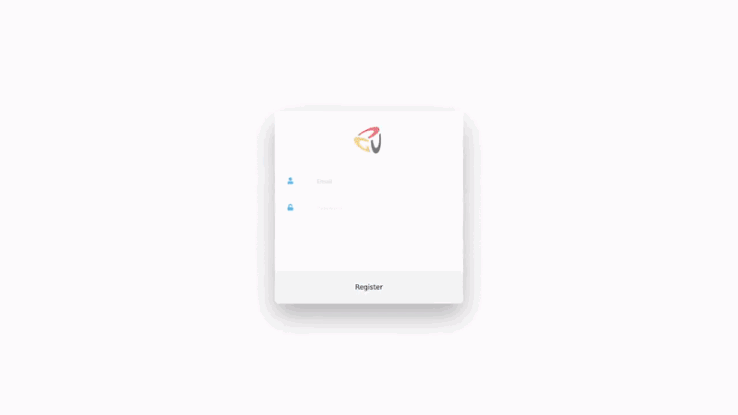
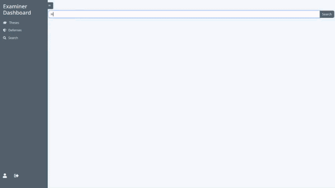
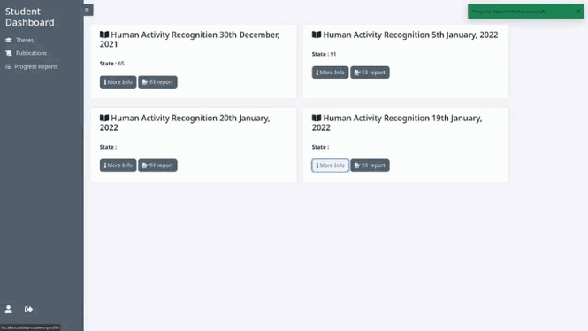
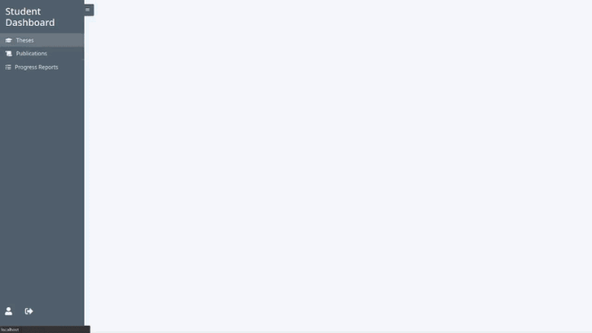
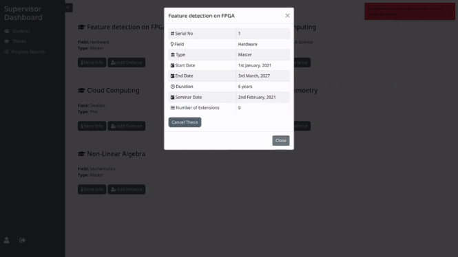

# Postgraduate Database System

## Description
This project is part of the Databases Course. The project is a PostGraduate system designed to keep track of student's theses (Masters or PHD), progress reports, publications along with their respective defenses. Furthermore, examiners and supervisors can register also to the system where the supervisor supervises the student and his/her thesis and the examiner examines the defenses of certain theses. There is also admin access where he/she can see all content in the system and has also certain authorities and capabilities, such as issuing payments, installments, and update extensions of specific theses.

## Tools and Technologies
This project was built using the following technologies:
- Node.js is an open-source, cross-platform, back-end JavaScript runtime environment that runs on the V8 engine and executes JavaScript code outside a web browser.
- Express.js is a web application framework for Node.js, which is a minimal and flexible Node.js web application framework designed for building web applications and APIs.
- Ejs is a templating engine for Node.js.
- MS SQL Server is a relational database management system (RDBMS) that is designed to provide a high-reliability, high-performance, and easy-to-use solution for the development of SQL-based applications.

Other tools:
- Git is a version control system for tracking changes in source code during software development.
- ffmpeg is a free and open source software library for realtime multimedia encoding and decoding.


## Sample GIF
1) Registering a new user
   


2) Searching for a thesis



3) Viewing and editing profile



4) Adding report



5) Adding defense




## Project Structure
<details>
<summary>Show Project Structure</summary>
<p>

```
.
├── bin
│   └── www
├── database  
│   ├── db-design                   <- data base design
│   │   ├── csv
│   │   │   ├── pg.csv            
│   │   │   └── pg.txt
│   │   ├── diagram                 <- EERD 
│   │   │   ├── final.drawio.pdf
│   │   │   └── final.drawio.xml
│   │   └── schema                  <- database relational schema
│   │       ├── schema.pdf
│   │       └── schema.tex
│   └── scripts                     <- data base implementation
│       ├── data-insertion.sql
│       ├── procedures.sql
│       ├── tables.sql
│       └── ... 
├── app.js                          <- launch server           
├── package.json
├── package-lock.json
├── README.md
├── procedures                      <- handle database procedures using js
│   ├── adminProcedures.js
│   ├── examinerProcedures.js
│   ├── supervisorProcedures.js
│   └── ... 
├── public                          <- static files
│   ├── images
│   │   └── guc_logo.png
│   ├── scripts
│   │   └── supervisorTheses.js
│   └── stylesheets                 <- css
│       ├── style.css
│       ├── dashboard.css
│       ├── errorStyle.css
│       └── ...
├── routes
│   ├── register.js
│   ├── login.js
│   ├── admin.js
│   └── ... 
├── utilities
│   ├── auth.js
│   └── toast.js
└── views
    ├── login.ejs
    ├── register.ejs
    ├── dashboardFooter.ejs
    ├── dashboardHeader.ejs
    ├── admin
    │   ├── adminDashboard.ejs
    │   ├── theses.ejs
    │   ├── supervisors.ejs
    │   └── ... 
    ├── student
    │   ├── studentDashboard.ejs
    │   ├── courses.ejs
    │   ├── profile.ejs
    │   └── ...
    └── ... 

```
</p>
</details>  


## Installation

1) In order to run the project, you need to install the following:
[MSSQL](https://www.microsoft.com/en-us/sql-server/sql-server-downloads)
[Node.js](https://nodejs.org/en/download/)

2) Clone the project from github
```bash
> git clone https://github.com/AhmedNasserG/pg-database.git
```

3) Run `npm i` command in the project folder
   
4) Create .env file in root directory like the below example
```
DB_USER_ADMIN="your_database_server_username"
DB_PASS_ADMIN="your_database_server_password"
PORT="port_number"
```

5) Execute [tables.sql](/database/scripts/tables.sql) (to create tables in the database), [stored-procedures](/database/scripts/procedures.sql) (to create procedures in the database), and [data-insertions](/database/scripts/data-insertion.sql) (to insert data in the database) (NOTE: you should execute these files in order to create the database)
   
6) Run `node app.js` (to launch the server)

# Authentication

Login credentials for testing purposes:

| Type | email | password|
| ---| ------| -------|
|GUCian Student|GUCStudent@test.com|student|
|Non-GUCian Student|NONGUCStudent@test.com|student|
|Supervisor|supervisor@test.com|supervisor|
|Admin|admin@test.com|admin|
|Examiner|examiner@test.com|examiner|

## Design

- [Color scheme](https://colorhunt.co/palette/f0f5f9c9d6df52616b1e2022)
- [Sidebar](https://codepen.io/jainharshit/pen/bGBRyLP)
- [Icons](https://fontawesome.com/v5.15/icons?d=gallery&p=2&m=free)

## Our Team
- [Ahmed Nasser](https://github.com/AhmedNasserG)
- [Abdulaziz Hassan](https://github.com/Abdulaziz-Hassan)
- [Elshimaa Betah](https://github.com/ShimaaBetah)
- [Ibrahim Abou Elenein](https://github.com/aboueleyes)